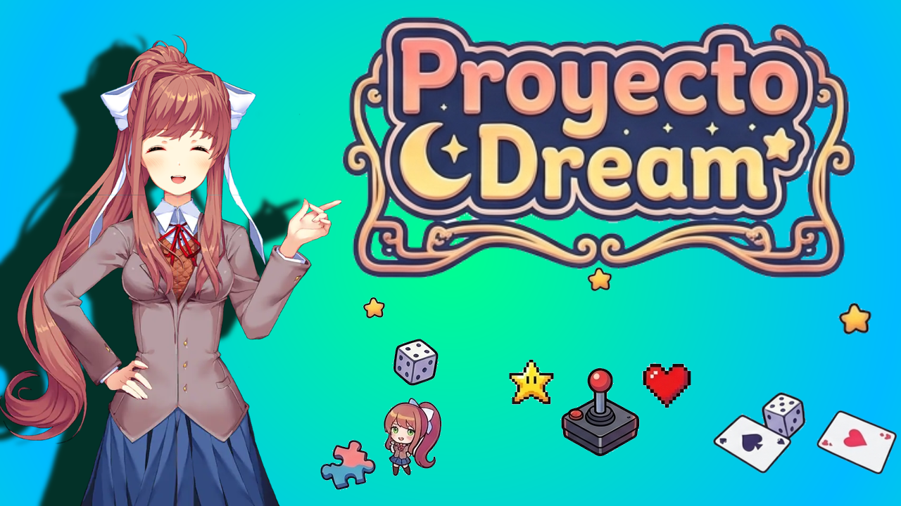

# Proyecto Dream

> Una colección de minijuegos y contenido adicional para **Monika After Story**.

---

## 📖 Acerca del proyecto

Proyecto Dream amplía la experiencia de Monika After Story con una colección de minijuegos, historias ilustradas, animaciones, sprites y contenido interactivo.

Actualmente incluye ocho minijuegos diferentes junto con varios extras diseñados para disfrutar de nuevos momentos con Monika.

---

## 🌟 Características

- 🎮 8 minijuegos
- 💝 Sistema de interacción
- 📚 Relatos de los Mitos de Cthulhu
- 🏠 Spaceroom con animaciones
- 🔫 Doki Gun
- 🗽 Pack de figuras Chibika
- 🌎 Disponible en Español e Inglés

---

# 📥 Instalación

1. Descargue la versión más reciente desde **Releases**.

2. Extraiga el archivo ZIP.

3. Copie la carpeta:

Proyecto Dream

dentro de:

Monika After Story/game/Submods/

4. Inicie Monika After Story.

> Se recomienda realizar una copia de seguridad de su progreso antes de instalar cualquier submod.

---

# 🎮 Minijuegos

## 💥 Chibika's Big Blast

*(Captura aquí)*

Inspirado en Mario Party. Escoge un detonador y espera que no sea el que haga explotar la bomba.

---

## ⛈ Storm Chasers

*(Captura aquí)*

Haz crecer tu planta antes que Monika encontrando la lluvia en el tablero.

---

## 🏚 Escape Room

*(Captura aquí)*

Explora una antigua mansión, resuelve acertijos y descubre los secretos ocultos mientras buscas escapar.

---

## 📢 Green Alert

*(Captura aquí)*

Pon a prueba tus reflejos presionando el botón justo cuando la señal cambie a verde.

---

## 🃏 Chibika Cardgame

*(Captura aquí)*

Selecciona cartas con efectos especiales e intenta conseguir más puntos que Monika antes de que termine la partida.

---

## 😛 Memoriza Emotes

*(Captura aquí)*

Memoriza ocho emotes en diez segundos y empareja correctamente antes de que termine el tiempo.

---

## 💣 Timer Boom

*(Captura aquí)*

Calcula el paso del tiempo con precisión. Cada error hará crecer el globo de Chibika hasta que... ¡Boom!

---

## 🏁 Dokis Racing

*(Captura aquí)*

Compite contra Monika utilizando el teclado o los botones virtuales para llegar primero a la meta.

---

# 💝 Experiencias

## Modo Interacción

*(Captura aquí)*

Interactúa con distintos puntos del escenario para descubrir animaciones y pequeñas sorpresas.

---

# 📚 Historias

## 😱 Mitos de Cthulhu

*(Captura aquí)*

Monika narra diversos relatos inspirados en los Mitos de Cthulhu utilizando imágenes y efectos de sonido.

---

# 🎁 Extras

## 🏠 Spaceroom

*(Captura aquí)*

Una versión alternativa de la habitación con una pequeña animación de Chibika.

---

## 🔫 Doki Gun

*(Captura aquí)*

Un pequeño extra lleno de sorpresas que invita al jugador a experimentar.

---

## 🗽 Pack de figuras Chibika

*(Captura aquí)*

Colección de diez figuras decorativas para el escritorio de Monika.

---

# 🤝 Créditos

Programación y desarrollo

- MasxRenpy

Agradecimientos

- Comunidad de Monika After Story

Créditos adicionales

- Dokis Racing utiliza un código base creado por otro autor (consultar el archivo de créditos incluido).

---

# ⚠️ Compatibilidad

Proyecto Dream requiere tener instalado Monika After Story.

---

# 📄 Licencia

La licencia del proyecto se encuentra disponible en el archivo licencia.
